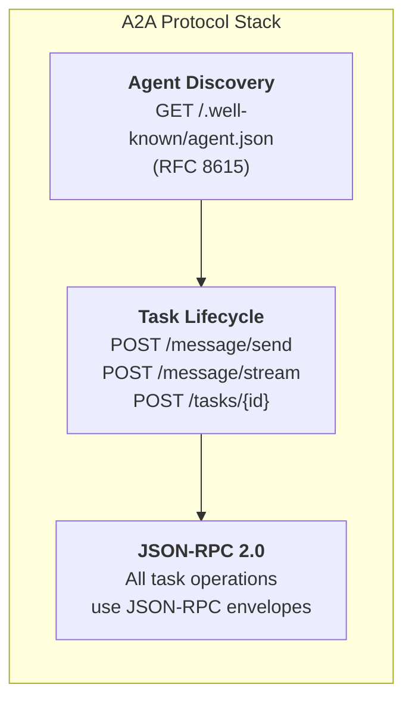
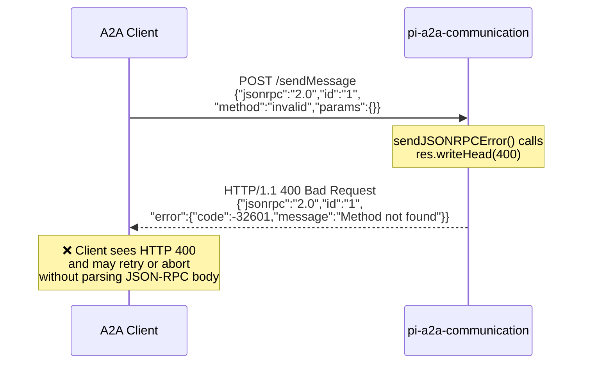
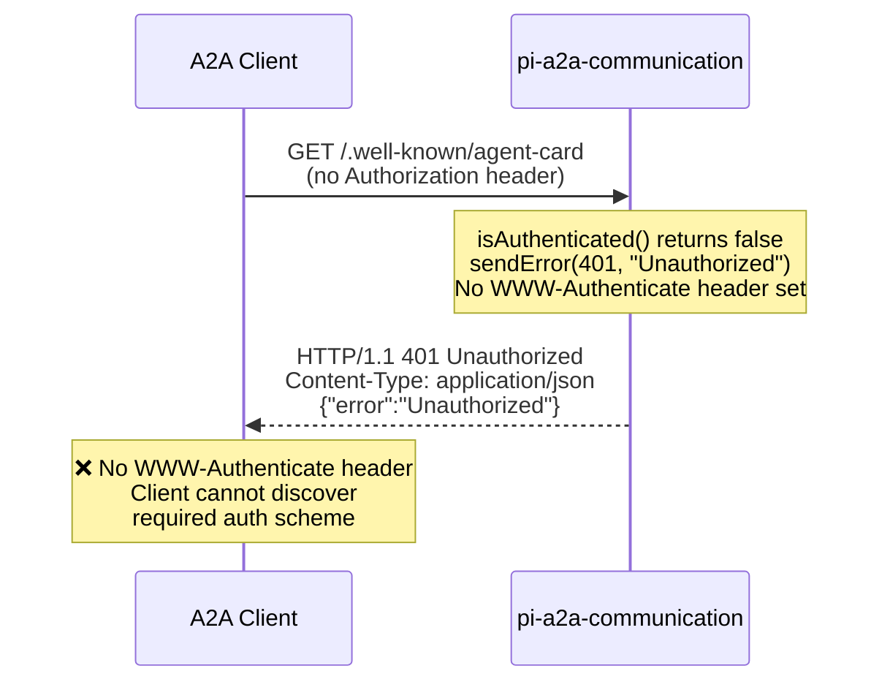
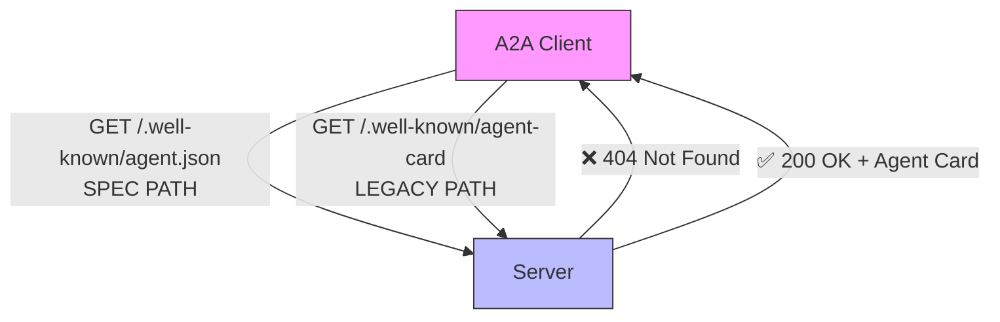
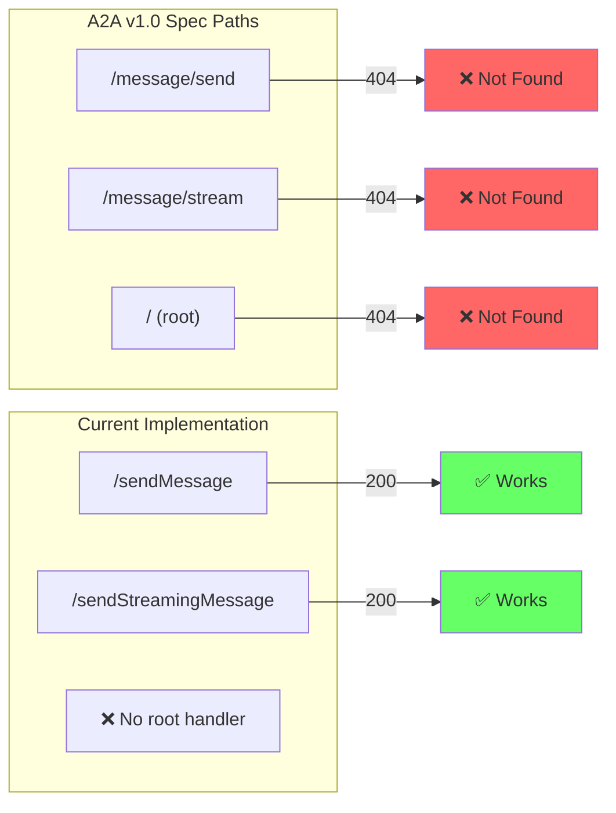
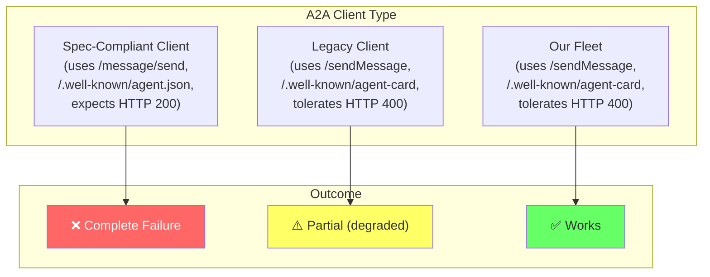

# A2A v1.0 Protocol Conformance Report

**Subject:** pi-a2a-communication@1.0.1 — Spec Compliance Gaps  
**Date:** 2026-06-19  
**Author:** Carlos Frias  
**Scope:** A2A Protocol v1.0 specification compliance audit  
**Package:** [npm:pi-a2a-communication@1.0.1](https://www.npmjs.com/package/pi-a2a-communication)  
**Upstream:** [DrOlu/pi-a2a-communication](https://github.com/DrOlu/pi-a2a-communication)  

---

## Executive Summary

We deployed `pi-a2a-communication@1.0.1` across a 7-node fleet and conducted a protocol conformance audit against the [A2A Protocol v1.0 specification](https://a2a-protocol.org). The implementation is **functional** — it correctly handles Bearer auth, serves Agent Cards, processes tasks, and streams results. However, it has **5 spec compliance gaps** that will cause interoperability failures with compliant A2A clients.

**Bottom line:** The package works for our fleet because we control both sides. Any third-party A2A client that follows the spec will fail to discover agents, send messages, or handle errors correctly.

| ID | Severity | Issue | Spec Requirement | Current Behavior |
|----|----------|-------|-------------------|------------------|
| S1 | 🔴 High | JSON-RPC errors return HTTP 400 | HTTP 200 per JSON-RPC 2.0 | `writeHead(400)` |
| S2 | 🟡 Medium | 401 responses lack `WWW-Authenticate` | RFC 7235 §2.1 | Header omitted |
| S3 | 🟡 Medium | `/.well-known/agent.json` returns 404 | A2A Spec §3.1 / RFC 8615 | Only `agent-card` works |
| S4 | 🔴 High | `/message/send` and `/message/stream` return 404 | A2A Spec §4.1-4.2 | Only `/sendMessage` works |
| S4b | 🟠 Medium | No root JSON-RPC dispatcher at `/` | A2A Spec §4 | `/` returns 404 |

---

## Background: What A2A Is

The **Agent-to-Agent (A2A) Protocol** is an open standard published by Google for inter-agent communication. It defines how AI agents discover each other, negotiate capabilities, and exchange tasks.

The protocol has two layers:



An A2A client that follows the spec will:

1. **Discover** — `GET /.well-known/agent.json` to fetch an Agent Card
2. **Authenticate** — `Authorization: Bearer <token>` header
3. **Send tasks** — `POST /message/send` with a JSON-RPC 2.0 envelope
4. **Handle errors** — Expect HTTP 200 with a JSON-RPC error body

The current implementation breaks steps 1, 3, and 4.

---

## Issue S1: JSON-RPC Errors Use Wrong HTTP Status Code

### The Spec

JSON-RPC 2.0 ([RFC 4627](https://www.jsonrpc.org/specification)) and the A2A specification both require that **JSON-RPC error responses use HTTP 200**. The HTTP status code indicates transport success; the error is communicated inside the JSON-RPC envelope.

> A JSON-RPC response MUST use HTTP 200, even when the response contains an error.  
> — JSON-RPC 2.0 Specification, §5

### The Bug



### Evidence

```bash
# Method not found → returns HTTP 400 (spec: HTTP 200)
$ curl -s -i -X POST http://localhost:10000/sendMessage \
  -H "Authorization: Bearer lab-fleet-2026" \
  -H "Content-Type: application/json" \
  -d '{"jsonrpc":"2.0","id":"1","method":"nonexistent","params":{}}'

HTTP/1.1 400 Bad Request          ← ❌ Should be 200
Content-Type: application/json
{"jsonrpc":"2.0","id":"1","error":{"code":-32601,"message":"Method not found"}}
```

### Root Cause

File: `dist/a2a-server.js`, line ~859-867:

```javascript
sendJSONRPCError(res, id, code, message, data) {
    const response = {
        jsonrpc: "2.0",
        id: id ?? 0,
        error: { code, message, data },
    };
    res.setHeader("Content-Type", "application/json");
    res.writeHead(400);   // ← BUG: Should be 200
    res.end(JSON.stringify(response));
}
```

### Fix

```javascript
res.writeHead(200);   // JSON-RPC errors are application-level, not transport-level
```

### Impact

- **Compliant clients** will treat HTTP 400 as a transport error and may not parse the JSON-RPC body
- **Retry logic** will trigger unnecessarily (400 = "bad request, don't retry" vs 200 + JSON-RPC error = "understood, but failed")
- **HTTP load balancers** may classify these as real errors and circuit-break the endpoint

---

## Issue S2: Missing WWW-Authenticate Header on 401 Responses

### The Spec

RFC 7235 §2.1 requires that **any 401 response MUST include a `WWW-Authenticate` header**:

> A server generating a 401 (Unauthorized) response MUST send a `WWW-Authenticate` header field containing at least one challenge.  
> — RFC 7235, Section 2.1

### The Bug



### Evidence

```bash
# 401 response without WWW-Authenticate
$ curl -sI http://localhost:10000/.well-known/agent-card

HTTP/1.1 401 Unauthorized
Access-Control-Allow-Origin: *
Access-Control-Allow-Methods: GET, POST, OPTIONS
Access-Control-Allow-Headers: Content-Type, Authorization
Content-Type: application/json
                                     ← ❌ No WWW-Authenticate header
```

### Root Cause

File: `dist/a2a-server.js`, line ~126:

```javascript
// Check authentication
if (!this.isAuthenticated(req)) {
    this.sendError(res, 401, "Unauthorized");  // ← No WWW-Authenticate header
    return;
}
```

Note: Line ~449 *does* set `WWW-Authenticate: Bearer` in the extended agent card handler, but this code path is unreachable because the main auth check at line ~126 fires first and returns 401 without the header.

### Fix

```javascript
if (!this.isAuthenticated(req)) {
    res.setHeader("WWW-Authenticate", "Bearer");
    this.sendError(res, 401, "Unauthorized");
    return;
}
```

### Impact

- **OAuth2/Bearer clients** rely on `WWW-Authenticate` to discover the required auth scheme
- **HTTP client libraries** (like Python `requests` or `httpx`) automatically retry with auth when they see `WWW-Authenticate: Bearer`
- Without the header, clients receive 401 and have no way to know what authentication is required

---

## Issue S3: Wrong Agent Card Discovery Path

### The Spec

A2A v1.0 §3.1 and RFC 8615 require Agent Cards to be discoverable at:

> `GET /.well-known/agent.json`

This follows the well-known URI convention (`.json` extension for machine-readable documents, per RFC 8615 §3).

### The Bug



### Evidence

```bash
# Spec path → 404
$ curl -s -o /dev/null -w "%{http_code}" \
  -H "Authorization: Bearer lab-fleet-2026" \
  http://localhost:10000/.well-known/agent.json
404

# Legacy path → 200
$ curl -s -o /dev/null -w "%{http_code}" \
  -H "Authorization: Bearer lab-fleet-2026" \
  http://localhost:10000/.well-known/agent-card
200
```

### Root Cause

File: `dist/a2a-server.js`, line ~130:

```javascript
if (path === "/.well-known/agent-card") {      // ← Only legacy path
    await this.handleAgentCard(req, res);
}
```

Only `agent-card` is recognized. The spec path `agent.json` falls through to the 404 handler.

### Fix

```javascript
if (path === "/.well-known/agent-card" || path === "/.well-known/agent.json") {
    await this.handleAgentCard(req, res);
}
```

### Impact

- **Spec-compliant discovery agents** will fail to find the Agent Card
- **A2A registry services** that crawl `/.well-known/agent.json` will get 404
- Only clients that hardcode `/agent-card` (legacy path) will succeed

---

## Issue S4: Wrong Message Endpoint Paths

### The Spec

A2A v1.0 §4 defines the message endpoints as:

| Method | Path | Purpose |
|--------|------|---------|
| `POST` | `/message/send` | Send a message (synchronous) |
| `POST` | `/message/stream` | Send a message (streaming SSE) |
| `POST` | `/` | JSON-RPC dispatch (all methods) |

### The Bug



### Evidence

```bash
# Spec path: /message/send → 404
$ curl -s -o /dev/null -w "%{http_code}" -X POST http://localhost:10000/message/send \
  -H "Authorization: Bearer lab-fleet-2026" \
  -H "Content-Type: application/json" \
  -d '{"jsonrpc":"2.0","id":"1","method":"message/send","params":{...}}'
404

# Legacy path: /sendMessage → 200
$ curl -s -o /dev/null -w "%{http_code}" -X POST http://localhost:10000/sendMessage \
  -H "Authorization: Bearer lab-fleet-2026" \
  -H "Content-Type: application/json" \
  -d '{"jsonrpc":"2.0","id":"1","method":"message/send","params":{...}}'
200

# Root JSON-RPC dispatcher: / → 404
$ curl -s -o /dev/null -w "%{http_code}" -X POST http://localhost:10000/ \
  -H "Authorization: Bearer lab-fleet-2026" \
  -H "Content-Type: application/json" \
  -d '{"jsonrpc":"2.0","id":"1","method":"message/send","params":{...}}'
404
```

### Root Cause

File: `dist/a2a-server.js`, line ~129-148:

```javascript
// Route requests
if (path === "/.well-known/agent-card") {
    await this.handleAgentCard(req, res);
}
else if (path === "/sendMessage" || path === "/sendStreamingMessage") {
    // ← Legacy paths only, no /message/send or /message/stream
    await this.handleSendMessage(req, res, path === "/sendStreamingMessage");
}
else if (path.startsWith("/tasks/")) {
    await this.handleTaskRequest(req, res, path);
}
else if (path === "/tasks") {
    await this.handleListTasks(req, res);
}
else {
    this.sendError(res, 404, "Not Found");  // ← No root dispatcher
}
```

### Fix

```javascript
// Add spec-compliant paths alongside legacy paths
if (path === "/.well-known/agent-card" || path === "/.well-known/agent.json") {
    await this.handleAgentCard(req, res);
}
else if (path === "/message/send" || path === "/sendMessage" ||
         path === "/message/stream" || path === "/sendStreamingMessage") {
    const streaming = path === "/message/stream" || path === "/sendStreamingMessage";
    await this.handleSendMessage(req, res, streaming);
}
else if (path === "/" || path === "") {
    // JSON-RPC dispatcher for root endpoint
    await this.handleJsonRPCRequest(req, res);
}
// ... rest of routing
```

### Impact

- **Any spec-compliant A2A client** will fail to send messages
- This is the highest-impact bug — message sending is the core A2A operation
- The legacy paths work, so existing integrations are unaffected, but new integrations following the spec will break

---

## Interoperability Impact Matrix



| Client Type | Discovery | Auth | Send Message | Error Handling | Overall |
|-------------|-----------|------|-------------|---------------|---------|
| **Spec-compliant** | ❌ 404 on `agent.json` | ❌ No `WWW-Authenticate` | ❌ 404 on `/message/send` | ❌ HTTP 400 hides JSON-RPC body | **Complete failure** |
| **Legacy-tolerant** | ✅ `agent-card` works | ⚠️ 401 but no header | ✅ `/sendMessage` works | ⚠️ Works by convention | **Partial** |
| **Our fleet** | ✅ | ✅ (we know the token) | ✅ | ✅ (we wrote the client) | **Works** |

---

## Recommended Fixes Summary

All fixes are in `dist/a2a-server.js`. The minified source makes PRs straightforward — each fix is a single-line or small-block change.

| ID | Fix | Lines Changed | Risk |
|----|-----|---------------|------|
| S1 | Change `writeHead(400)` → `writeHead(200)` in `sendJSONRPCError()` | 1 line | Low — JSON-RPC clients already handle error bodies |
| S2 | Add `res.setHeader("WWW-Authenticate", "Bearer")` before 401 response | 1 line | None — purely additive |
| S3 | Add `path === "/.well-known/agent.json"` to route condition | 1 line | None — adds alias |
| S4 | Add `/message/send` and `/message/stream` routes alongside legacy paths | ~3 lines | Low — backward compatible |
| S4b | Add root path `/` JSON-RPC dispatcher | ~15 lines | Medium — new handler needed |

---

## Conformance Test Suite

A self-contained Vitest test suite is included at:

**`tests/a2a-v1-conformance.test.ts`**

Any project using `pi-a2a-communication` can reproduce these findings by running:

```bash
npm install pi-a2a-communication vitest
npx vitest run a2a-v1-conformance.test.ts
```

The test suite spins up an A2A server with a test token, sends protocol-compliant requests, and asserts the expected behavior against the spec. Each failing test maps directly to an issue in this report.

---

## Appendix: Source Code References

All line numbers reference `pi-a2a-communication@1.0.1` npm package, file `dist/a2a-server.js`.

| Issue | Function | Line | Code |
|-------|----------|------|------|
| S1 | `sendJSONRPCError()` | ~866 | `res.writeHead(400)` → should be `200` |
| S2 | `handleRequest()` | ~126 | Missing `WWW-Authenticate` before `sendError(res, 401)` |
| S3 | `handleRequest()` | ~130 | Only `/agent-card` route, no `/agent.json` |
| S4 | `handleRequest()` | ~137 | Only `/sendMessage` route, no `/message/send` |
| S4b | `handleRequest()` | ~148 | No root `/` JSON-RPC dispatcher, falls through to 404 |

---

*End of report. This document is intended for upstream maintainers of `DrOlu/pi-a2a-communication` and any organization evaluating A2A protocol compliance.*