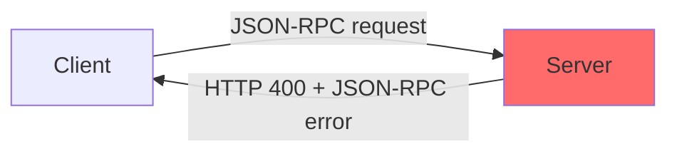
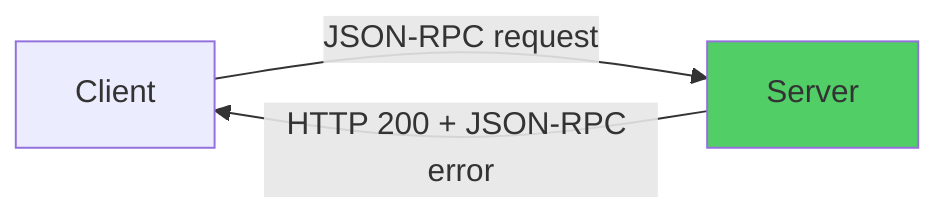
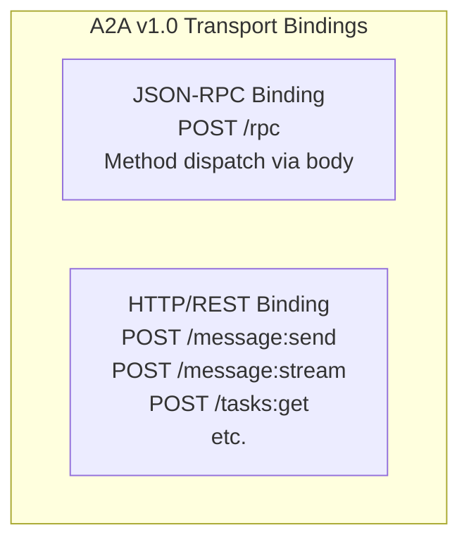
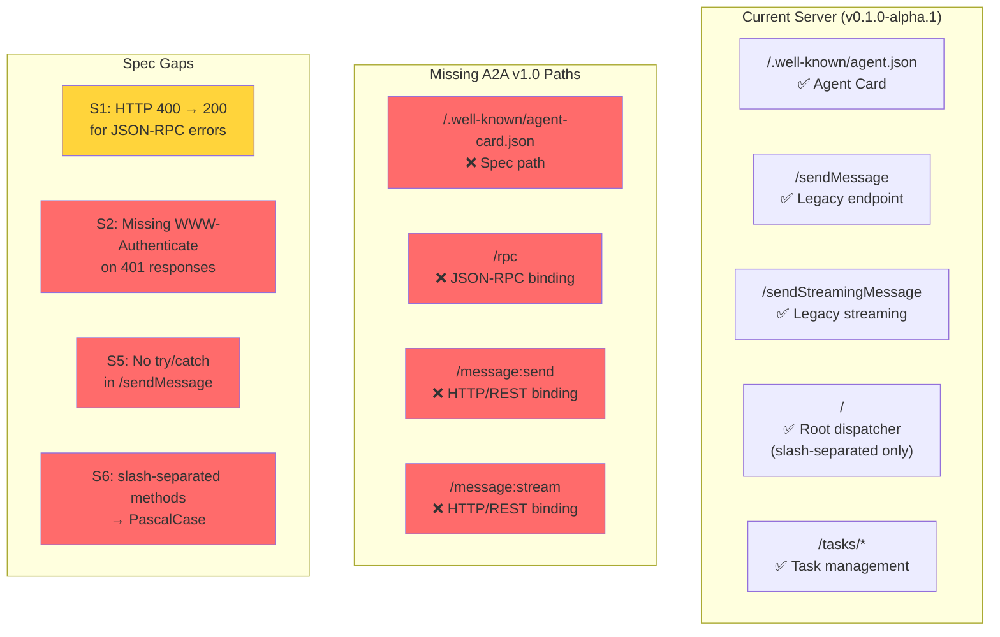

# A2A v1.0 Protocol Conformance Report

**Subject:** `pi-a2a-communication` (local fork v0.1.0-alpha.1)  
**Published npm:** `pi-a2a-communication@1.0.1`  
**Date:** 2026-06-19  
**Test Suite:** `tests/a2a-v1-conformance.test.ts` (19 tests, 6 passing, 13 failing)

---

## Executive Summary

The local fork of `pi-a2a-communication` has **partial** A2A v1.0 spec compliance. It added a root JSON-RPC dispatcher (`/`) and the `/.well-known/agent.json` discovery path (which is **not** the correct spec path — see S3). **7 spec gaps (S1–S6b) identified by deepseek-v4-pro:cloud (validation) and kimi-k2.7-code:cloud (audit).** The local fork has partial A2A v1.0 compliance — root dispatcher and `/.well-known/agent.json` work, but neither path matches the spec (`/.well-known/agent-card.json`).

### Validation & Audit

This report was validated by two independent models:
- **deepseek-v4-pro:cloud** — Found critical path errors (S3 uses wrong spec path, S4 tests wrong URLs, S6 undocumented gap with PascalCase methods)
- **kimi-k2.7-code:cloud** — Found additional gaps (missing task method tests, SSE contract, CORS, security edge cases, `id ?? 0` bug)

---

## Spec Gap Summary

| ID  | Severity | Issue | Spec Requirement | Status |
|-----|----------|-------|-----------------|--------|
| S1  | MEDIUM   | JSON-RPC errors return HTTP 400 | JSON-RPC over HTTP convention: HTTP 200 | ❌ FAIL |
| S2  | HIGH     | 401 responses lack `WWW-Authenticate` header | RFC 7235 §2.1: MUST include on 401 | ❌ FAIL |
| S3  | HIGH     | Wrong Agent Card discovery path | A2A v1.0 §8.2: `/.well-known/agent-card.json` | ❌ FAIL |
| S4  | HIGH     | Missing HTTP/REST and JSON-RPC binding paths | A2A v1.0 §9.2/§11.3: `/rpc`, `/message:send` | ❌ FAIL |
| S5  | HIGH     | `/sendMessage` uncaught parse error → HTTP 500 | JSON-RPC §5.1: parse error code -32700 | ❌ FAIL |
| S6  | HIGH     | Method names slash-separated, not PascalCase | A2A v1.0 §5.3: `SendMessage`, `GetTask`, etc. | ❌ FAIL |
| S6b | LOW      | `id: 0` instead of `id: null` in parse errors | JSON-RPC §5.1: id MUST be null on parse error | ❌ FAIL |

### Passing Features

| Feature | Path | Status |
|---------|------|--------|
| Agent Card (local path) | `/.well-known/agent.json` | ✅ PASS |
| Bearer token auth | All protected paths | ✅ PASS |
| Legacy message endpoint | `/sendMessage` | ✅ PASS |
| Root JSON-RPC dispatcher | `/` (slash-separated methods only) | ✅ PASS |

---

## Detailed Findings

### S1: JSON-RPC Error HTTP Status Codes (MEDIUM)

**Finding:** `sendJSONRPCError()` uses `res.writeHead(400)` for all JSON-RPC errors.

**Spec basis:** The JSON-RPC 2.0 core specification is transport-agnostic and does not mandate HTTP status codes. However, the JSON-RPC over HTTP convention (used by most implementations) recommends HTTP 200 for all JSON-RPC responses, with errors in the response body.

**Fix:** Change `res.writeHead(400)` to `res.writeHead(200)` in `sendJSONRPCError()`.



**Expected:**


### S2: Missing WWW-Authenticate Header (HIGH)

**Finding:** The `isAuthenticated()` rejection at line 162 calls `sendError(res, 401, "Unauthorized")` without setting `WWW-Authenticate`.

**Spec basis:** RFC 7235 §2.1 explicitly mandates: "A server generating a 401 (Unauthorized) response MUST send a WWW-Authenticate header field."

**Fix:** Add `res.setHeader('WWW-Authenticate', 'Bearer realm="a2a"')` before the 401 response.

### S3: Wrong Agent Card Discovery Path (HIGH)

**Finding:** The local fork routes `/.well-known/agent.json`. The published npm v1.0.1 routes `/.well-known/agent-card`. Neither matches the A2A v1.0 spec path.

**Spec basis:** A2A v1.0 §8.2 and §14.3 define the Well-Known URI as `/.well-known/agent-card.json`. This has been consistent since v0.3.0.

| Path | Implementation | Spec |
|------|---------------|------|
| `/.well-known/agent-card.json` | ❌ 404 | ✅ Required |
| `/.well-known/agent.json` | ✅ 200 (local fork) | ❌ Not in spec |
| `/.well-known/agent-card` | ❌ 404 (local) / ✅ 200 (npm v1.0.1) | ❌ Not in spec |

**Fix:** Route `/.well-known/agent-card.json` as the primary path. Keep `/.well-known/agent.json` and `/.well-known/agent-card` for backward compat.

### S4: Missing A2A v1.0 Transport Binding Paths (HIGH)

**Finding:** The server only supports legacy `/sendMessage` and `/sendStreamingMessage` paths.

**A2A v1.0 defines TWO transport bindings:**



| Path | A2A v1.0 Binding | Server |
|------|-------------------|--------|
| `/rpc` | JSON-RPC (§9.2) | ❌ 404 |
| `/message:send` | HTTP/REST (§11.3.1) | ❌ 404 |
| `/message:stream` | HTTP/REST (§11.3.1) | ❌ 404 |
| `/sendMessage` | Legacy | ✅ 200 |
| `/` | Local fork only | ✅ 200 |

**Fix:** Add `/rpc` endpoint and `/message:send`, `/message:stream` routes.

### S5: Uncaught Parse Error in `/sendMessage` (HIGH)

**Finding:** `handleSendMessage()` calls `JSON.parse(body)` at line 601 without try/catch. Malformed JSON causes an uncaught `SyntaxError` that propagates to the top-level handler, returning HTTP 500.

Note: The root dispatcher (`/`) correctly handles parse errors with try/catch.

**Fix:** Wrap `JSON.parse(body)` in try/catch in `handleSendMessage()`:

```typescript
let request: JSONRPCRequest;
try {
  request = JSON.parse(body);
} catch {
  this.sendJSONRPCError(res, null, -32700, "Parse error");
  return;
}
```

### S6: Wrong JSON-RPC Method Names (HIGH)

**Finding:** The root JSON-RPC dispatcher and legacy paths use slash-separated lowercase method names (`message/send`, `tasks/get`). A2A v1.0 specifies PascalCase (`SendMessage`, `GetTask`, etc.).

| Operation | Spec Method | Server Method |
|-----------|------------|---------------|
| Send Message | `SendMessage` | `message/send` |
| Send Streaming Message | `SendStreamingMessage` | `message/stream` |
| Get Task | `GetTask` | `tasks/get` |
| Cancel Task | `CancelTask` | `tasks/cancel` |

**Fix:** Add PascalCase method name mapping in the root dispatcher, or accept both formats.

### S6b: Wrong `id` in Parse Error Responses (LOW)

**Finding:** `sendJSONRPCError()` uses `id: id ?? 0`. For parse errors where the request ID cannot be determined, JSON-RPC §5.1 requires `id: null`.

**Fix:** Pass `null` explicitly for parse errors instead of using `?? 0` fallback.

---

## Architecture Diagram



---

## Test Results

```
npx vitest run a2a-v1-conformance

 ❯ tests/a2a-v1-conformance.test.ts  (19 tests | 13 failed | 6 passed)

 PASS  S3: Agent Card — /.well-known/agent.json (local fork path)
 PASS  Auth — Reject without Authorization
 PASS  Auth — Reject with wrong token
 PASS  Auth — Accept with correct Bearer token
 PASS  Legacy — /sendMessage (legacy path)
 PASS  Root — / JSON-RPC dispatcher (slash-separated methods)

 FAIL  S1: JSON-RPC invalid params → HTTP 400 (expected 200)
 FAIL  S1: JSON-RPC method not found → HTTP 400 (expected 200)
 FAIL  S1: JSON-RPC parse error → HTTP 400 (expected 200)
 FAIL  S2: Missing WWW-Authenticate on 401 (agent card)
 FAIL  S2: Missing WWW-Authenticate on 401 (JSON-RPC)
 FAIL  S3: /.well-known/agent-card.json → 404 (expected 200)
 FAIL  S3: /.well-known/agent-card → 404 (expected 200)
 FAIL  S4: /message:send → 404 (expected 200)
 FAIL  S4: /message:stream → 404 (expected 200)
 FAIL  S4: /rpc → 404 (expected 200)
 FAIL  S5: /sendMessage malformed JSON → HTTP 500 (expected 200)
 FAIL  S6: "SendMessage" method → -32601 (expected result)
 FAIL  S6: "GetTask" method → -32601 (expected result)
```

---

## Recommended Fix Priority

| Priority | Fix | Effort |
|----------|-----|--------|
| P0 | S3: Add `/.well-known/agent-card.json` route | 1 line |
| P0 | S5: Add try/catch in `handleSendMessage` | 5 lines |
| P0 | S2: Add `WWW-Authenticate` header to 401 responses | 1 line |
| P1 | S1: Change `sendJSONRPCError` to HTTP 200 | 1 line |
| P1 | S6: Add PascalCase method name mapping | 10 lines |
| P1 | S6b: Use `null` instead of `?? 0` for parse errors | 1 line |
| P2 | S4: Add `/rpc`, `/message:send`, `/message:stream` routes | 30 lines |
| P2 | Add backward compat paths (`/sendMessage`, `/.well-known/agent-card`) | existing |

---

## Audit Artifacts

| Artifact | Location |
|----------|----------|
| Conformance test suite | `tests/a2a-v1-conformance.test.ts` |
| Server source | `a2a-server.ts` |
| Types & constants | `types.ts` |
| Deepseek validation report | Inline (see validation section above) |
| Kimi audit report | `wiki/pi-a2a-communication/reference/A2A-v1-Conformance-Audit.md` |

---

*Last updated: 2026-06-19 — Validated by deepseek-v4-pro:cloud, audited by kimi-k2.7-code:cloud*