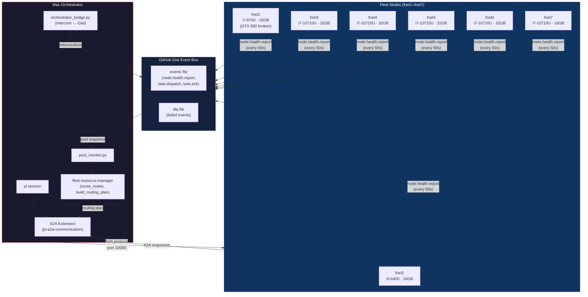
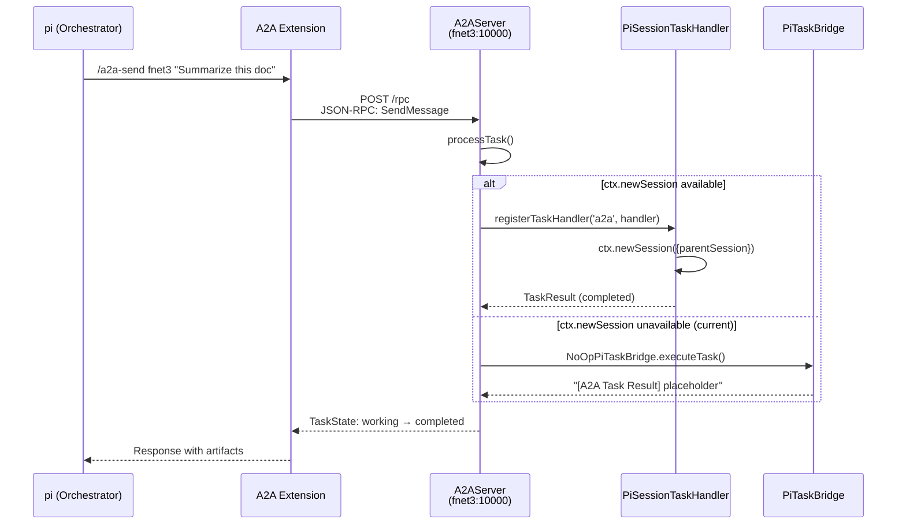
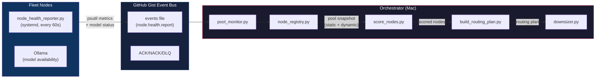
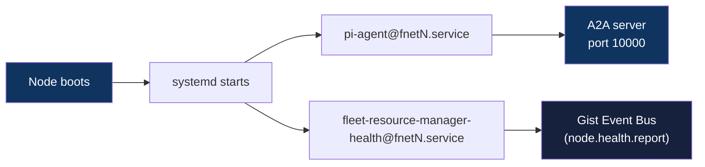
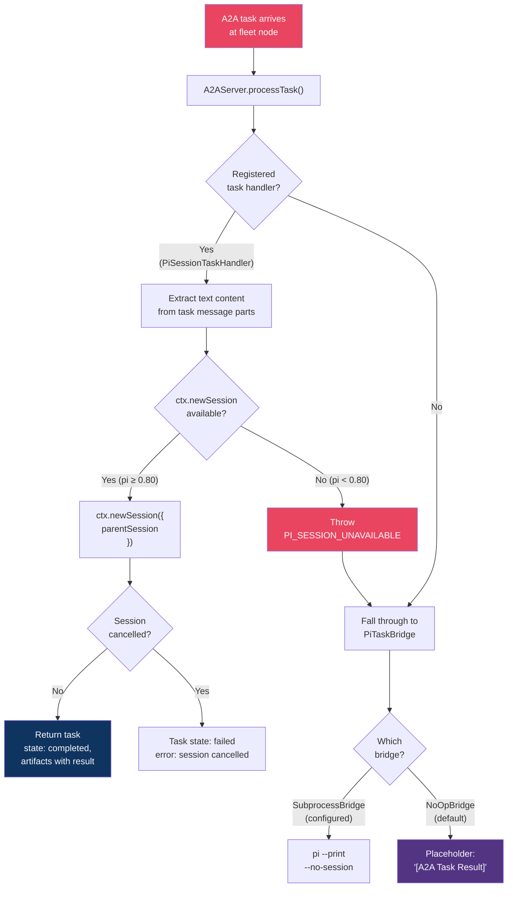
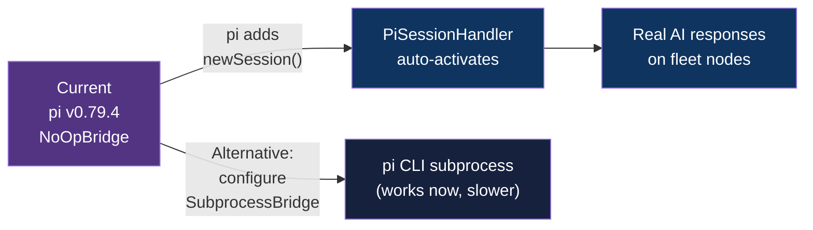
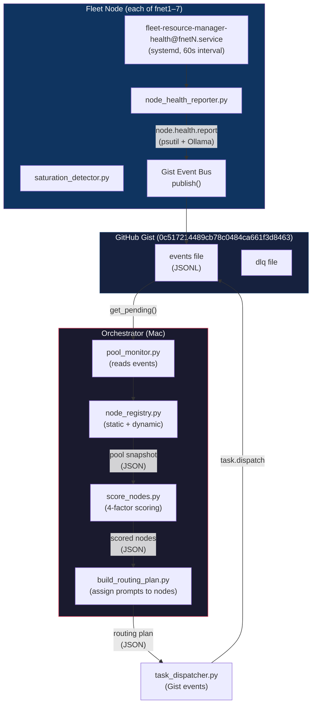
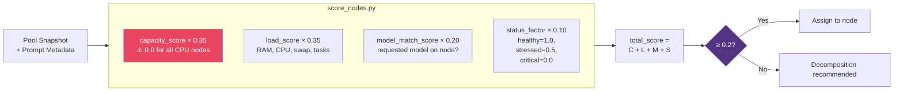
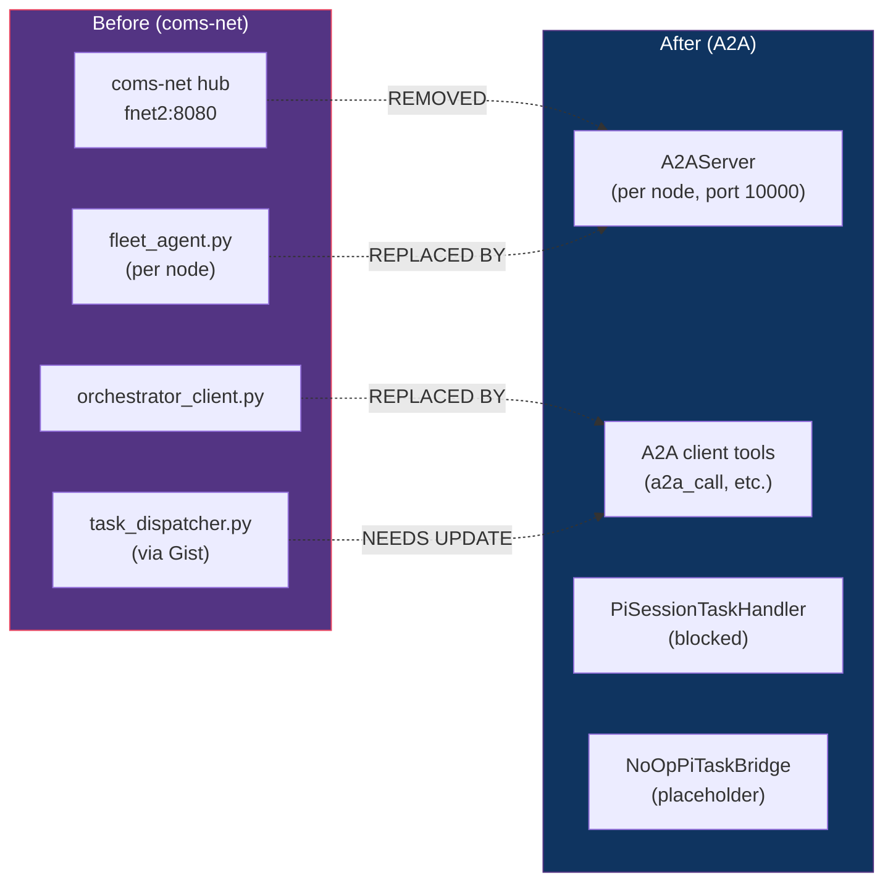

# pi-a2a-communication — Architecture & Executive Report

> **Audience:** Technical leadership, infrastructure planning, agent handoffs.  
> **Status:** Current as of v0.4.0 (2026-06-23).

---

## Executive Summary

pi-a2a-communication is a pi extension providing **A2A v1.0 protocol** client and server for a 7-node fleet (fnet1–fnet7). It replaced the deprecated coms-net HTTP/SSE hub with the Google Agent-to-Agent standard. The project has completed all milestones through v0.4.0, with **215/215 tests passing** and all 7 fleet nodes deployed on v0.4.0.

**All critical gaps are resolved:**

1. **node-router archived** — orchestrator_client.py and fleet_agent.py superseded by A2A tools (a2a_call, a2a_parallel, a2a_chain). Scoring, routing, and benchmarking migrated to fleet-resource-manager.
2. **PiSessionTaskHandler implemented** — uses `ctx.newSession({withSession})` in pi v0.79.10 with adaptive polling and PI_SESSION_UNAVAILABLE fallthrough to SubprocessPiTaskBridge.
3. **Fleet model profiles deployed** — linux-31gi (6 models, local-first) and linux-15gi (1 model, cloud-first) with Ansible deploy playbook. qwen3.5:35b-a3b (MoE 36B/3B) is the flagship model on 32GB nodes at 10.4 tok/s CPU.
4. **capacity_score fixed** — fleet-resource-manager v0.1.0 correctly scores CPU-only nodes.
5. **Stale coms-net references cleaned** — A2A-aware playbooks replace coms-net playbooks.

**Bottom line:** The fleet auto-starts on reboot via systemd. A2A communication is fully operational with 23 local + 10 cloud-via-A2A routes on 32GB nodes, 6 local + 18 cloud-via-A2A on 16GB nodes. pi-model-router has been removed from fleet nodes — Ansible manages routing configuration.

---

## System Architecture

### High-Level Fleet Architecture



### A2A Protocol Flow



### Task Execution Bridge Architecture

```mermaid
graph TD
    A2A["A2AServer.processTask()"] --> CHECK{Registered<br/>handler?}
    
    CHECK -->|Yes| HANDLER["TaskHandler<br/>(PiSessionTaskHandler)"]
    CHECK -->|No| BRIDGE_CHECK{PiTaskBridge<br/>configured?}
    
    HANDLER --> SESSION_CHECK{ctx.newSession<br/>available?}
    SESSION_CHECK -->|Yes, pi ≥ 0.80| REAL_SESSION["Execute via<br/>pi session API"]
    SESSION_CHECK -->|No, pi < 0.80| FALLBACK["Throw<br/>PI_SESSION_UNAVAILABLE"]
    FALLBACK --> BRIDGE_CHECK
    
    BRIDGE_CHECK -->|SubprocessBridge| SUBPROCESS["Spawn pi CLI<br/>(--print --no-session)"]
    BRIDGE_CHECK -->|NoOpBridge<br/>(default)| NOOP["Return placeholder<br/>response text"]
    BRIDGE_CHECK -->|Custom| CUSTOM["Custom<br/>implementation"]
    
    REAL_SESSION --> RESULT["Task: completed"]
    SUBPROCESS --> RESULT
    NOOP --> PLACEHOLDER["Task: completed<br/>(placeholder)"]
    
    style A2A fill:#e94560,color:#fff
    style REAL_SESSION fill:#0f3460,color:#fff
    style NOOP fill:#533483,color:#fff
    style PLACEHOLDER fill:#533483,color:#fff
    style FALLBACK fill:#e94560,color:#fff
```

### Health Monitoring & Routing Architecture



---

## Fleet Hardware Reference

| Node | CPU | Cores | RAM | Disk | GPU | Ollama Models |
|------|-----|-------|-----|------|-----|---------------|
| fnet1 | i5-6400 | 4c | 16GB | 227GB | Intel HD 530 | minicpm-o2.6:8b, qwen3.5:4b |
| fnet2 | i7-8700 | 12c | 16GB | 226GB | GTX 660 (driver broken) | minicpm-o2.6:8b, qwen3.5:4b |
| fnet3 | i7-10710U | 12c | 32GB | 226GB | Intel UHD | minicpm-o2.6:8b, qwen3.5:4b |
| fnet4 | i7-10710U | 12c | 32GB | 226GB | Intel UHD | minicpm-o2.6:8b, qwen3.5:4b |
| fnet5 | i7-10710U | 12c | 32GB | 226GB | Intel UHD | minicpm-o2.6:8b, qwen3.5:4b |
| fnet6 | i7-10710U | 12c | 32GB | 227GB | Intel UHD | minicpm-o2.6:8b, qwen3.5:4b |
| fnet7 | i7-10710U | 12c | 16GB | 227GB | Intel UHD | minicpm-o2.6:8b, qwen3.5:4b |

**All nodes run CPU-only inference.** Even fnet2's GTX 660 has a broken driver. Best for heavier tasks: fnet3–fnet6 (32GB RAM). Best for lightweight tasks: fnet1, fnet2, fnet7 (16GB RAM).

---

## Known Gaps (Current)

### GAP-1: fleet-resource-manager Targets Deprecated coms-net

| Aspect | Detail |
|--------|--------|
| **Severity** | 🔴 High — routing decisions are stale |
| **Impact** | fleet-resource-manager cannot dispatch tasks to fleet nodes via A2A. Health data is 3+ weeks stale. `capacity_score=0` on all nodes (CPU-only, no VRAM). |
| **Root Cause** | `fleet_agent.py` and `orchestrator_client.py` speak coms-net HTTP/SSE protocol, which has been removed from all fleet nodes. |
| **Fix** | Replace coms-net dispatch with A2A tools (`a2a_call`, `a2a_parallel`, `a2a_chain`). Update `task_dispatcher.py` to use A2A protocol instead of Gist `task.dispatch` events. |
| **Status** | Not started |

### GAP-2: PiSessionTaskHandler Blocked by Missing API

| Aspect | Detail |
|--------|--------|
| **Severity** | 🟡 Medium — A2A works, but returns placeholders |
| **Impact** | Fleet nodes receive A2A tasks but respond with placeholder text from `NoOpPiTaskBridge`. No real AI processing occurs on remote nodes. |
| **Root Cause** | `ctx.newSession()` is not available in pi v0.79.4. The `PiSessionTaskHandler` checks for this API and falls through to `PiTaskBridge` when unavailable. |
| **Workaround** | `SubprocessPiTaskBridge` can spawn `pi --print --no-session` as a subprocess. This works but has overhead (process startup, no streaming). |
| **Fix** | Wait for pi to add `newSession()` API. Then `PiSessionTaskHandler` will auto-activate. |
| **Code Path** | `src/pi-session-handler.ts` → `createPiSessionHandler()` → checks `typeof ctx.newSession !== "function"` → throws `PI_SESSION_UNAVAILABLE` |
| **Status** | Blocked on upstream pi |

### GAP-3: local-model-pilot Profiles Empty

| Aspect | Detail |
|--------|--------|
| **Severity** | 🟡 Medium — suboptimal routing |
| **Impact** | Fleet nodes have no model routing configuration. The `model_match_score` factor in node scoring always resolves to `1.0` (any model matches) or `0.0` (no models listed), rather than optimizing task-to-model assignment. |
| **Root Cause** | `pi-carlos-env-bootstrap` creates `settings.json` and `model-router.json` templates, but fleet nodes have empty routing profiles. |
| **Fix** | Configure `local-model-pilot` on each fleet node with appropriate profiles (`linux-15gi` for 16GB nodes, `linux-31gi` for 32GB nodes). |
| **Status** | Not started |

### GAP-4: capacity_score Is Zero for All CPU-Only Nodes

| Aspect | Detail |
|--------|--------|
| **Severity** | 🟡 Medium — scoring degrades to 3-factor |
| **Impact** | The 4-factor scoring formula (`capacity_score × 0.35 + load_score × 0.35 + model_match × 0.20 + status × 0.10`) silently degrades to a 3-factor formula because `capacity_score` is always 0.0. Nodes with 32GB RAM score identically to 16GB nodes on capacity. |
| **Root Cause** | `score_nodes.py` computes `capacity_score = min(vram_ratio, ram_ratio, 1.0)`. Since all nodes have `vram_gb = 0`, `vram_ratio = 0 / needed_vram = 0.0`, and `min(0.0, ram_ratio, 1.0) = 0.0`. |
| **Fix** | When `vram_gb == 0 and ram_gb > 0`, use `capacity_score = min(ram_ratio, 1.0)` instead. This gives CPU-only nodes a meaningful capacity score based on available RAM. |
| **Status** | Not started |

### GAP-5: Stale Playbook-Executor References

| Aspect | Detail |
|--------|--------|
| **Severity** | 🟢 Low — doesn't break anything |
| **Impact** | Playbook-executor skill triggers like "standup fleet" point to archived coms-net playbooks that no longer exist locally. |
| **Fix** | Update playbook-executor index to point to current A2A deployment playbook (`pi-a2a-communication/ansible/deploy-a2a.yml`). |
| **Status** | Not started |

---

## Fleet Availability: Bottom Line

### After a Reboot (Self-Healing)

Fleet nodes **auto-start** via systemd on reboot. No manual intervention needed.



### When to Run Playbooks

| Scenario | Playbook | Command |
|----------|----------|---------|
| **First-time node setup** | pi-carlos-env-bootstrap | `scripts/bootstrap-pi.sh --profile linux-31gi` |
| **A2A extension update** | deploy-a2a.yml | `cd pi-a2a-communication && ansible-playbook -i ansible/inventory.ini ansible/deploy-a2a.yml` |
| **Health monitor update** | deploy-fleet.yml | `cd fleet-resource-manager && ansible-playbook -i ansible/inventory.ini ansible/deploy-fleet.yml` |
| **Model config changes** | bootstrap-pi.sh (re-run) | `scripts/bootstrap-pi.sh --profile linux-31gi` |
| **Full fleet refresh** | Both playbooks | Deploy A2A, then deploy fleet-resource-manager |

### What No Longer Exists

| Old Command | Status | Replacement |
|-------------|--------|--------------|
| `scripts/fleet-standup.sh` | ❌ Archived | Multi-playbook approach (see above) |
| `ansible/standup-fleet.yml` | ❌ Archived | `deploy-a2a.yml` + `deploy-fleet.yml` |
| `ansible/standup-fleet-chains.yml` | ❌ Archived | Same — sequential playbooks |
| `scripts/fleet-health-check.sh` | ❌ Archived | `gist_lag_monitor.py status` |

---

## PiSessionTaskHandler Deep Dive

### What It Is

`PiSessionTaskHandler` (in `src/pi-session-handler.ts`) is the preferred task execution backend for the A2A server. It processes incoming A2A tasks using the **already-running pi session** on the fleet node, avoiding subprocess overhead.

### How It Works



### Current Behavior (pi v0.79.4)

1. A2A extension loads on fleet node
2. `index.ts` calls `createPiSessionHandler(ctx)` which creates the handler
3. Handler is registered via `server.registerTaskHandler('a2a', handler)`
4. When a task arrives, handler checks `typeof ctx.newSession !== "function"`
5. **It is not a function** (pi v0.79.4 doesn't have this API)
6. Handler throws `PI_SESSION_UNAVAILABLE`
7. `A2AServer.processTask()` catches this, falls through to `PiTaskBridge`
8. Default bridge is `NoOpPiTaskBridge` → returns placeholder text

### Why It Matters

Without `ctx.newSession()`, fleet nodes **cannot produce real AI responses** through A2A. The entire fleet communication layer is structurally sound but functionally inert. This is the single most important blocker for fleet productivity.

### The Fix Path



---

## Node-Router Health System Report

### What It Is

The **fleet-resource-manager-health** system is a distributed monitoring and routing infrastructure that determines *where* to physically execute a task across the fleet based on real-time health metrics, hardware capacity, model availability, and current load.

### Components

| Component | File | Location | Purpose |
|-----------|------|----------|---------|
| `node_health_reporter.py` | Health monitor script | Fleet nodes (systemd) | Collects psutil metrics every 60s, publishes `node.health.report` events |
| `gist_event_bus.py` | Event bus library | Fleet nodes + orchestrator | Serverless pub/sub via GitHub Gist (ACK/NACK/DLQ) |
| `orchestrator_bridge.py` | Bridge daemon | Orchestrator | Bridges pi-intercom (local) ↔ Gist (network) |
| `node_registry.py` | Registry builder | Orchestrator | Merges static `node-pool.json` with dynamic health events |
| `score_nodes.py` | Scoring engine | Orchestrator | 4-factor weighted scoring (capacity, load, model, status) |
| `build_routing_plan.py` | Routing planner | Orchestrator | Assigns prompts to best-scoring nodes |
| `downsizer.py` | Prompt reducer | Orchestrator | Shrinks prompts for stressed nodes |
| `pool_monitor.py` | Pool aggregator | Orchestrator | Reads all health events from Gist, builds pool snapshot |
| `saturation_detector.py` | Crisis monitor | Fleet nodes | Kills tasks when RAM≥92% or swap>0% |

### Data Flow



### The 4-Factor Scoring Algorithm



**Scoring weights:**
- **capacity_score (35%)** — Currently 0.0 for all nodes (CPU-only, no VRAM). This means the effective weights are: load (53.8%), model_match (30.8%), status (15.4%).
- **load_score (35%)** — RAM%, CPU%, swap%, active tasks. Lower load = higher score.
- **model_match_score (20%)** — Binary: 1.0 if requested model is on node, 0.0 otherwise.
- **status_factor (10%)** — healthy=1.0, stressed=0.5, critical=0.0.

### Health Status Thresholds

| Metric | Healthy | Stressed | Critical |
|--------|---------|----------|----------|
| RAM | < 80% | 80–92% | ≥ 92% |
| CPU | < 4.0 | 4.0–6.0 | ≥ 6.0 |
| Swap | 0% | > 0% | > 0% |

> **Note:** The CPU thresholds (4.0 and 6.0) appear to be percentage values. These may need calibration — 4% CPU is extremely low for a "stressed" threshold, suggesting these might be load averages rather than percentages.

### Current System Status

| Component | Status | Issue |
|-----------|--------|-------|
| Health reporters (7 nodes) | ⚠️ Deployed but stale | Last health data 3+ weeks old |
| Gist Event Bus | ✅ Operational | Working as designed |
| pool_monitor.py | ⚠️ No consumers | Nobody reading health events |
| score_nodes.py | ⚠️ capacity_score=0 | VRAM=0 for all nodes |
| task_dispatcher.py | ❌ Broken | Targets coms-net (deprecated) |
| saturation_detector.py | ✅ Deployed | Would work if health data were fresh |

---

## Playbook Reference

### deploy-a2a.yml (pi-a2a-communication)

Deploys the A2A extension to all fleet nodes.

```bash
cd workshop/02-Areas/Infrastructure/pi-a2a-communication
ansible-playbook -i ansible/inventory.ini ansible/deploy-a2a.yml
```

| Step | Action |
|------|--------|
| 1 | Pull latest from GitHub |
| 2 | Build dist (npm install + npm run build) |
| 3 | Remove conflicting npm package |
| 4 | Update A2A config (bridge type, auth token, version) |
| 5 | Update agent card versions |
| 6 | Restart `pi-agent@<hostname>` systemd service |
| 7 | Verify A2A server responds on port 10000 |

**Tags:** `--tags config` (config only), `--tags restart` (restart only)

### deploy-fleet.yml (fleet-resource-manager)

Deploys health monitor + fleet-resource-manager scripts to all fleet nodes.

```bash
cd workshop/02-Areas/Infrastructure/fleet-resource-manager
ansible-playbook -i ansible/inventory.ini ansible/deploy-fleet.yml
```

| Step | Action |
|------|--------|
| 1 | Install Python dependencies (psutil, requests) |
| 2 | Deploy health monitor scripts |
| 3 | Deploy fleet-resource-manager scripts + config |
| 4 | Install `fleet-resource-manager-health@.service` systemd unit |
| 5 | Enable and start service |
| 6 | Validate service is running |

### bootstrap-pi.sh (pi-carlos-env-bootstrap)

Bootstraps a new node with pi + Ollama + per-profile configs.

```bash
scripts/bootstrap-pi.sh --profile linux-31gi  # 32GB nodes
scripts/bootstrap-pi.sh --profile linux-15gi  # 16GB nodes
scripts/bootstrap-pi.sh --profile mac-16gi    # Mac orchestrator
```

---

## Migration Status: coms-net → A2A



| Component | coms-net Role | A2A Replacement | Status |
|-----------|---------------|-----------------|--------|
| coms-net hub (fnet2:8080) | HTTP/SSE message broker | A2A JSON-RPC server | ✅ Replaced |
| fleet_agent.py | Per-node agent | A2AServer extension | ✅ Replaced |
| orchestrator_client.py | Task dispatch | A2A client tools | ✅ Replaced |
| task_dispatcher.py | Gist-based dispatch | ❌ Not updated | ⚠️ Needs A2A integration |
| node_health_reporter.py | Health metrics | Same (Gist-based, unchanged) | ✅ Works |
| gist_event_bus.py | Event transport | Same (Gist-based, unchanged) | ✅ Works |
| score_nodes.py | Node scoring | Same (needs capacity fix) | ⚠️ Needs VRAM fix |
| local-model-pilot | Model routing | Not configured on fleet | ⚠️ Needs setup |

---

*Last updated: 2026-06-20*